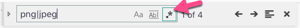

= Exercise 3 - Navigate and Refactor with ease
:experimental: true

== Essential Shorcuts

Practice and commit to memory these essential keyboard shortcuts

|===
|Action |Shortcut

|Toggle Sidebar 
|kbd:[Ctrl] / kbd:[Cmd] + kbd:[B]

|Go to Previous File
|kbd:[Ctrl] / kbd:[Cmd] + kbd:[P] + kbd:[P]

|New Window
|kbd:[Ctrl] / kbd:[Cmd] + kbd:[N]

|Close Window
|kbd:[Ctrl] / kbd:[Cmd] + kbd:[W]
|===

== Moving, Duplicating and Removing

You can learn a few keyboard shortcuts that can dramatically improve your editing speed. Namely, Moving lines, duplicating lines and removing lines.

[Attributes]
|===
|Action |Shortcut

|Duplicate row
|kbd:[Alt] / kbd:[Option] + kbd:[Shift] + kbd:[↓] 

|Move line up/down
|kbd:[Alt] / kbd:[Option] + kbd:[↓]/kbd:[↑]

|Delete Line
|kbd:[Alt] / kbd:[Option] + kbd:[Shift] + kbd:[k]

|===

1. Open the `index.html` file in this folder.

2. Move the 

=== Collapsing Sections

Find the `svg` element in the `index.html` page and collapse it.

.Solution
[%collapsible]
====
* kbd:[Ctrl] / kbd:[Cmd] + kbd:[Shift] + kbd:[P] 
* Select "Fold"
* kbd:[Enter]

OR

* kbd:[Ctrl] / kbd:[Cmd] + kbd:[Alt] / kbd:[Option] + kbd:[[]
====

=== Multiple Cursors

You can create multiple cursors to edit multiple instances of the same string at the same time.

Open the `src/app.js` file. Rename the "circle" variable to "colorCircle".

.Solution
[%collapsible]
====
* Put the cursor on the first occurence of the `circle` variable declaration.
* kbd:[Ctrl] / kbd:[Cmd] + kbd:[D] to add a cursor to the second instance
* Type "colorCircle"
====

== Finding Things

There are a few different ways to find things. One is with the Find/Replace UI, and the other is with the symbol browser.

=== Find using Find/Replace

The images in the `index.html` file are broken. They should be prefixed with `images/`. Find and update both of them using the "Find/Replace" method.

.Solution
[%collapsible]
====
1. Press kbd:[Ctrl] / kbd:[Cmd] + kbd:[F]
2. Type `png|jpeg` in the find box
3. Select the "Regular Expression" modifier 

4. Press kbd:[Ctrl] / kbd:[Cmd] + kbd:[Alt] / kbd:[Option] + kbd:[Enter]
5. Press kbd:[Ctrl] / kbd:[Cmd] + kbd:[Alt] / kbd:[Option] + kbd:[←] to move the cursor to the beginning of the image path
6. Type `images/`
====

=== Renaming

Change the "colorCircle" back to "circle" using Rename refactor

.Solution
[%collapsible]
====
* kbd:[Ctrl] / kbd:[Cmd] + kbd:[P]
* Type "@"
* Find "colorCircle"
* kbd:[Enter]
* kbd:[F2]
* Type "circle"
====

=== Extracting Methods

The "extract method" refactor is used a lot. It's helpful for when you have a block of code you want to extract into it's own method.

Extract the code that creates the "pastColor" circle to a method called "createColorCircle".

.Solution
[%collapsible]
====
* Find the following block of code...
    ----
    let pastColor = document.createElement("div");
    pastColor.className = "pastColor";
    pastColor.style = `background-color: #${color}`;
    pastColor.addEventListener("click", () => {
      this.setColor(color);
    });
    ----
* Highlight the text and press kbd:[Ctrl] / kbd:[Cmd] + `.`
* Select "Extract to global scope"
* Name it "createColorCircle"
* Move the "createColorCircle function up into the `App` object by selecting the whole method and pressing kbd:[Alt] / kbd:[Option] + kbd:[↑]
====

=== Multiple Cursors: Super Bonus

1. Open the `package.json` file in this folder and select all of the "devDependences"
2. Paste them into a new file - do not save the file
3. Using multiple cursors, transform the list into a valid `npm install` statement...

.Solution
[%collapsible]
====
1. Select the first `"`
2. Add a cursor the front of each line with kbd:[Ctrl] / kbd:[Cmd] + kbd:[Alt] / kbd:[Option] + kbd:[↓]
3. Delete the `"` at the start of each line
4. Move all the cursors the end of their relative lines with kbd:[Ctrl] / kbd:[Cmd] + kbd:[→]
5. Use kbd:[Alt] / kbd:[Option] + kbd:[Shift] + kbd:[←] to select text on all lines back to the last `"` and delete the `"`
6. Use kbd:[Ctrl] / kbd:[Cmd] + kbd:[←] to move the cursor to the front of the line and add a space
7. Move the cursor to the end of all lines with kbd:[Alt] / kbd:[Option] + kbd:[→] and add a kbd:[,]
8. Highlight the invivible return character on each line and delete it to put all items on one line
9. Move the cursor back to the front of the line with kbd:[Ctrl] / kbd:[Cmd] + kbd:[←] and type `npm install`
====